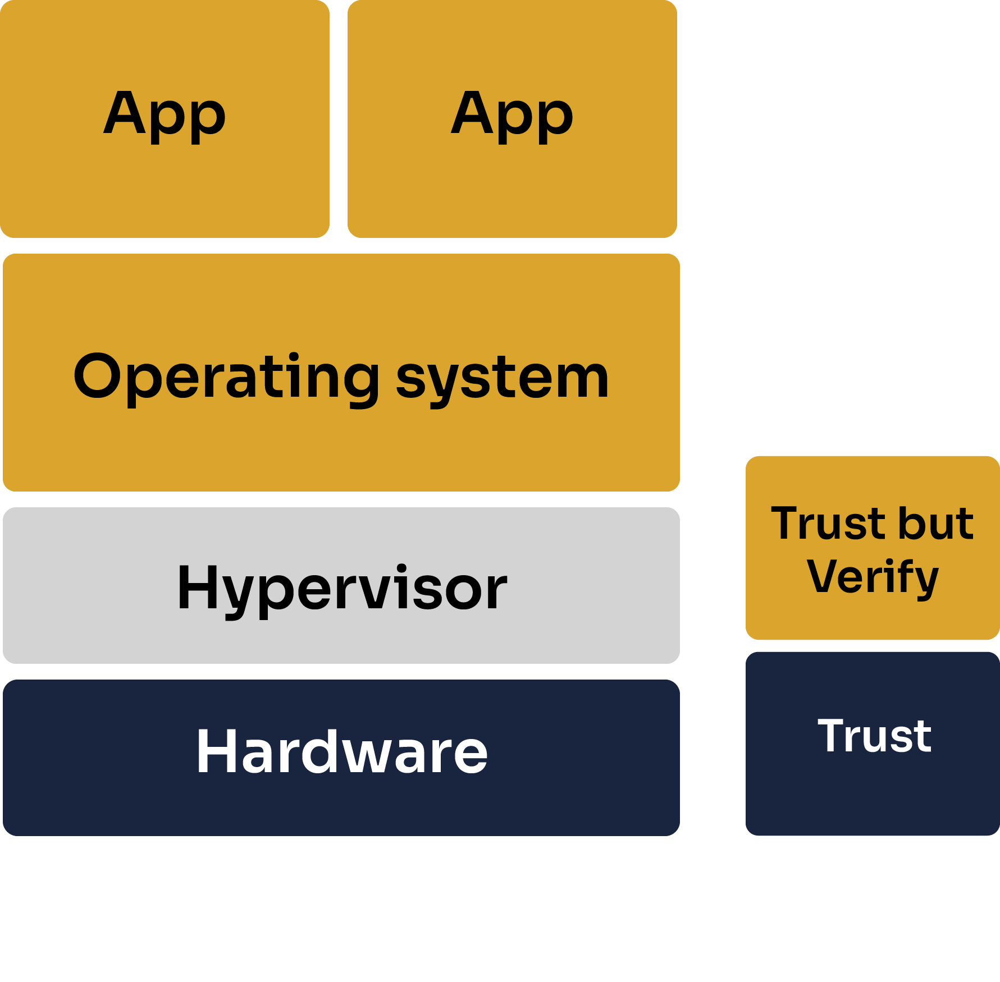

# AMD SEV-SNP
________________________________________

BlindBox protects user data using by deploying SaaS solutions within **Trusted Execution Environments (TEEs)**. One of the TEEs we currently support is the AMD SEV-SNP confidential VM. In this guide, we will take a look at how this technology works and how it is implemented in BlindBox.

> If you want some more contextual information about TEEs, check out our introductory guide to confidential computing [here](../getting-started/confidential_computing.md).

## AMD SEV-SNP
________________________

AMD SEV-SNP is an example of a confidential VM. Confidential VMs take the key concepts of confidential computing, runtime encryption, isolation and remote attestation, and apply them to whole VMs.

AMD SEV VMs are available with Azure or Google Cloud.

### Trusted Execution Environment (TEE)

One of the key advantages of confidential VMs is that we are not restricted as we can be when creating applications for enclaves. Confidential VMs offer easy-of-use and are compatible with most existing applications, even when they are large or complex applications.

The code and data of the VM is secured by encryption. An attacker or malicious insider without the encryption key cannot cannot view the VM's memory. This encryption key is generated from a hardware random number generator and is stored in dedicated hardware registers where software cannot read it. The decrypted version is only available within the VM itself.

### Trusted Computing Base (TCB)

??? question "What is the TCB?"

	
	Normally, when you run an application on a computer, you **need to trust multiple elements**: the application itself, the operating system, the hypervisor and the hardware. This doesn't mean we "*trust*" them in the everyday sense of the word - this means that our application could be affected by a bug or vulnerability in these elements. These trusted elements make up what we call the **Trusted Computing Base** or TCB of our application.
	

AMD SEV-SNP trusts but verifies the application and OS running in the TEE. Aside from these elements, we only trust AMD hardware and AMD-signed firmware. 

A key difference with AMD SEV-SNP TEEs compared with Nitro enclaves is that AMD SEV-SNP offers protections against the cloud provider.

The hypervisor and host system are NOT trusted.

> Note that [memory DIMMs](https://en.wikipedia.org/wiki/DIMM), otherwise known as RAM sticks, are also implicitly trusted.

### Attestation

With the release of AMD SEV-SNP, attestation is now supported for all workloads.

During the attestation process, an attestation report is created allowing the client to verify that they are communicating with a genuine AMD SEV-SNP VM and providing the client with a public key which which they can establish secure communication with the VM.

For BlindBox, the attestation process is implemented using [Azure's attestation tools](https://azure.microsoft.com/en-us/products/azure-attestation).

### Limitations

+ **AMD-SEV SNP** has historically been vulnerable to side channel attacks, where attackers try to get information about a TEE indirectly, by examining things like memory consumption or power usage.

## Further reading

Google Project Zero & Google CLoud Security conducted a detailed security review of AMD SEV-SNP, released in May 2022 which you can view [here](https://storage.googleapis.com/gweb-uniblog-publish-prod/documents/AMD_GPZ-Technical_Report_FINAL_05_2022.pdf).
