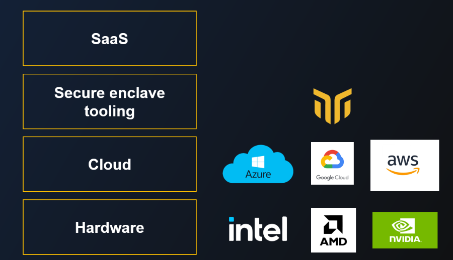

# The Confidential Computing ecosystem
_______________________________

??? abstract "Learn more about Confidential Computing 📖" 

	+ [Our intro to Confidential Computing](../getting-started/confidential_computing.md)
	+ [A guide to AMD-SEV](./amd-sev.md)
	+ [Confidential Computing Explained](https://confidential-computing-explained.mithrilsecurity.io/en/latest/), a hands-on course to learn how enclaves work and how to create your own mini key management system (KMS).

## Introduction
_______________

This concept guide presents a brief overview of the Confidential Computing landscape and covers how BlindBox fits into that space. 

> We recommend reading [our intro to Confidential Computing](../getting-started/confidential_computing.md) first, if you are not familiar with the technology.

| BlindBox Compatibility | Azure | GCP | AWS |
| :--------------------- | :---- | :-- | :-- |
| `AMD SEV SNP`       | :material-check: Supported  | :material-timer-sand: Under test | :grey_question: Not tested yet | 
| `AWS Nitro Enclave`       | :material-close: NA[^1]  | :material-close:  NA | :material-check: Supported | 
| `Nvidia Confidential GPU`     | :material-timer-sand: Under test | :material-close: NA  | :material-close:  NA |
| `Intel SGX`     | :material-check: Supported (with [BlindAI](../past-projects/blindai.md)) | :material-close: NA  | :material-close:  NA |
| `Intel TGX`     | :grey_question: Not tested yet | :grey_question: Not tested yet | :material-close:  NA |

[^1]: NA: Not available.

## Hardware
_________________

Currently, most hardware providers offer server-side CPUs with confidential computing abilities: 

+ **Intel** was the first with [**SGX/TDX**](https://blindai.mithrilsecurity.io/en/latest/docs/concepts/SGX_vs_Nitro/#intel-sgx) enclaves, available on Xeon. 
+ **AMD** came up with [**SEV**](./amd-sev.md) on EPYC, a solution they call Confidential VMs. 
+ **AWS** provides [**Nitro Enclaves**](./nitro-enclaves.md), a solution at the hypervisor level which isolates sensitive workloads.
+ **Nvidia** is bringing yet another CC solution to the table: **Confidential GPUs**. They announced the **H100**, but the software libraries are not stable at the moment[^2].

[^2]: 10 May 2023.

??? question "A Confidential Computing terminology guide 📚"

	 
	All the different technical terms surrounding confidential computing can be confusing. You'll see people referring to **secure enclaves**, preaching **TEEs** and suddenly switching to **Confidential Containers**. 

	+ **Trusted Execution Environment** (TEE): Trusted execution environments (TEEs) are secure environments for data processing created by the processor of a system. Enclaves and Confidential VMs are examples of TEEs.
	
	+ **Enclaves**: Enclaves are secure TEEs which exist within a larger system. They are isolated from other users and processors on a given host. Intel SGX enclaves are the most well-known example of enclaves, but other Confidential Computing technologies use this terminology too, even where their technology differs greatly to Intel SGX! It may be that the term enclave goes on to be used quite broadly for various confidential computing TEEs, despite varying implementations.

	+ **Confidential VMs**: Confidential VMs take the key principals of Confidential Computing and apply them to a whole VM, meaning, unlike enclaves, they can run almost any workload without modifying anything!

	+ **Confidential Containers**: These are containers that are run inside a Confidential TEE.
	

## Cloud
_____________________

Most major Cloud providers have also created their own flavor of Confidential Computing solutions. They allow SaaS vendors to easily access a machine with the required hardware for deploying applications with CC solutions (the 'right' hardware being one of the biggest barrier of entry to use confidential computing).

- **Azure** went with **Azure Confidential Computing**
- **GCP** offers **GCP Confidential Computing**
- **AWS** proposes **AWS Nitro Enclave**

It's important to note that those offers mostly cover the infrastructure level of confidential computing abilities. Developers using them **have to implement** complex security features such as attestation or sealing.

## BlindBox's position
_________________

It can be complicated for developers to implement key confidential computing functions properly, like isolation, attested TLS with remote attestation and sealing, because Confidential Computing uses low-level hardware primitives. 

This is where BlindBox comes in. It provides an easy-to-use secure enclave tooling solution to leverage the confidential infrastructure of Cloud providers. Its abstraction layer allows SaaS vendors to deliver an on-premise level of security and control to users of their software.

Not only does BlindBox facilitate the secure deployment of applications in Confidential TEEs, but we offer additional security layers so that users can set custom access and networking policies for their BlindBox. 

At the moment, BlindBox is still under development so it's not yet suitable for use in production. It is currently only compatible with Azure Confidential VMs, but our aim is for it to be hardware and Cloud agnostic in the future. 