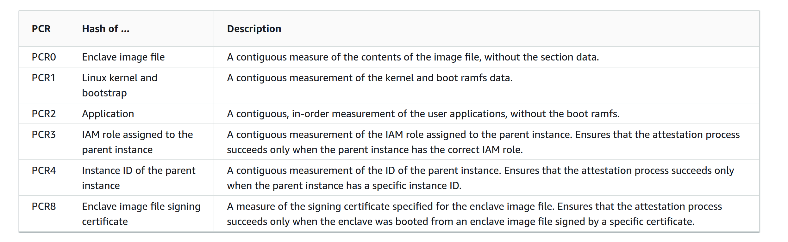

# Nitro Enclaves
________________________________________

??? abstract "Learn more about Confidential Computing 📖" 

	+ [Our intro to Confidential Computing](../getting-started/confidential_computing.md)
	+ [Discover the Confidential Computing ecosystem](../concepts/ecosystem.md)
	+ [A guide to AMD SEV](./amd-sev.md)
	+ [Confidential Computing Explained](https://confidential-computing-explained.mithrilsecurity.io/en/latest/), a hands-on course to learn how enclaves work and how to create your own mini-KMS

BlindBox protects user data using by deploying SaaS solutions within **Trusted Execution Environments (TEEs)**. One of the TEEs we'll soon develop support for is **AWS Nitro Enclave**. In this guide, we will take a look at how this technology works.

## Nitro Enclaves
________________________

Nitro Enclaves were developed by AWS to **create secure compute environments** for users on **AWS EC2 VM instances**.

### Trusted Execution Environment (TEE)

The AWS TEE isolation is based on **virtualization**. Users can partition off a certain amount of the host EC2’s memory and CPU and assign it to their enclave which then runs along-side the host instance.

**The isolation or separation between the two environments is the same as that of two different users’ EC2 instances**. The host cannot read or access the data in the enclave and vice versa. Any communication between the host and enclave is done through a **VSOCK**.

!!! important "Advantages of the virtualization approach"

	
	One benefit of pursuing this virtualization approach compared to a memory encryption approach is that **the host instance has absolutely no visibility over the enclave’s memory whatsoever**. This memory simply doesn’t exist from the host's perspective. This means the host cannot attempt to gain any information about the enclave through side-channel attacks, monitoring what memory is in use or any access patterns, etc.
	

By default, Nitro enclaves support **limited operations to reduce their attack surface**. They have **no durable storage, no network/interactive access, no metadata services, DNS, NTP**, etc… 

### Trusted Computing Base (TCB)

!!! question "What is the TCB?"

	
	Normally, when you run an application on a computer, you **need to trust multiple elements**: the application itself, the operating system, the hypervisor and the hardware. This doesn't mean we "*trust*" them in the everyday sense of the word - this means that our application could be affected by a bug or vulnerability in these elements. These trusted elements make up what we call the **Trusted Computing Base** or TCB of our application.
	

It is important to note that while some Confidential Computing solutions have pursued a very minimalistic TCB this is not the case for Nitro enclaves, because it isn't the objective behind their offer. 

!!! quote "<a href="https://aws.amazon.com/fr/blogs/security/confidential-computing-an-aws-perspective/" target="__blank"> According to AWS</a>:"

	
	*A Nitro enclave has the same level of protection from the cloud operator as a normal Nitro-based EC2 instance, **but adds the capability for customers to divide their own systems** into components with different levels of trust.*
	

This is why Nitro enclaves include the same elements in their TCB as most standard applications today. However, they do support **cryptographic attestation**, which will verify the application code and the enclave's OS. 

While pursuing a smaller TCB can be one way to reduce the attack surface (since our application would not be impacted by any bugs or vulnerabilities occurring in the untrusted elements, such as a bug in the AWS hypervisor), it is important to note that reducing your TCB size is not the only way to reduce the attack surface and often involves tradeoffs between different measures.

### Attestation

The **attestation process** allows users to **verify that the enclave, the code running in it and the OS of the enclave have not been tampered with**. This process is achieved through the **Nitro hypervisor**, which produces a signed attestation document for the enclave to prove its identity to the client.

The attestation certification contains the following information about the enclave:

A client wishing to connect with the enclave will verify that this information matches with the enclave application they are expecting to connect to. For example, the BlindBox client expects this information to match with the latest official version of the BlindBox demo API server by default.

You can compare this process to using a checksum to verify the authenticity of a software downloaded online.

### Limitations

+ **AWS as the cloud provider, their hardware and the enclave’s OS** must be **trusted**. That is because Nitro enclaves are designed to separate and isolate the host from the enclave and vice versa, but they do not protect against the cloud operator (AWS) or infrastructure.

+ While Nitro enclaves limit operations within enclaves by default (such as no durable storage, no network/interactive access), **any of these features can be added back** into an enclave application **by the application provider**, so it's impossible to assume a Nitro enclave will never have any of these features.