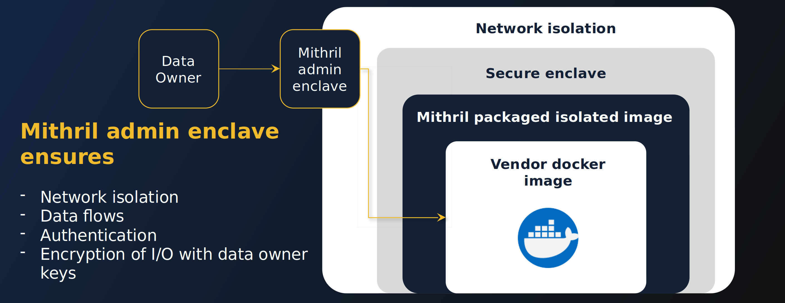

# How we protect your data
_________________________________

BlindBox protects user data with two key elements: 
+ By leveraging **confidential computing** technologies to deploy applications within secure hardware-based highly-isolated environment called **Trusted Execution Environments (TEEs)**.
+ By allowing users to set **custom security policies** to control what can happen in this environment!

Let's now take a look at the technologies behind our solution and how they protect user data!

### Confidential Computing

In typical workflows, data may be encrypted in transit, but it is accessible in clear when being analyzed by software. [Confidential computing](https://en.wikipedia.org/wiki/Confidential_computing) is a fast-growing new technology which aims to tackle this problem and protects data during computation.

Solutions usually center around three key concepts:
+ Isolation: data is processed in highly-isolated TEEs
+ Attestation: We verify the authenticity of the TEE and its components 
+ Runtime encryption: Data is encrypted, even during analysis

Let's dive into a bit more detail about these concepts

### Isolation & encryption
____________________________________

In a confidential workflow, data is sent to and analyzed within a **Trusted Execution Environment (TEE)**, otherwise known as a secure enclave. Data sent to the enclave is only decrypted inside the enclave. Even if hackers or malicious insiders gain access to the host machine an enclave is running on, they will not be able to access data inside the enclave.

### Attestation
___________________

When a user wants to establish communication with an enclave, checks will first be performed to **verify the authenticity** of **the enclave identity and anything running inside the enclave** such as the **application** and **the trusted OS (where relevant)**. This protcess is called attestation.

!!! warning "Important"
    
    The goal of this process is to check that the code running is indeed the code of the application we are expecting and that it has not been tampered with. The attestation doesn't **audit the application code itself**. You could compare it to using a checksum utility when you download a software.
    

❌ If any of these **checks fail**, an error is produced and the **user will not be able to communicate with the enclave**. For BlindBox, this means that a user will only be able to connect to a genuine, verified TEE.

✔️ If these checks are **successful**, the user is able to **communicate** with the enclave **securely using TLS**. The enclave's private key never leaves the enclave, so it is never accessible to anyone, including the cloud or service provider!

[to add in: image] 

### TEEs in BlindBox
______________________

We currently support the following TEEs: **Nitro enclaves** developed **by AWS**  and the **AMD SEV-SNP confidential VM**.

> To learn more about Nitro enclaves, check out our guide [here](../concepts/nitro-enclaves.md).
> To learn more about AMD SEV-SNP, check out our guide [here](../concepts/amd-sev.md).

## Limitations of TEEs
__________________________

With great security features comes great responsibilities! TEEs also have limitations which are very important to know.

+ The **application code running in the TEE *must* be trusted**! While the attestation process verifies the authenticity of the enclave, it does not run any checks on what the verified application code does itself. Therefore, while data is protected from external access from outside the TEE, we must trust that the application code itself is not malicious.

This is why we are creating an additional security layer where data owners will be able to apply custom security policies to their BlindBox. This will include who can query the service in their BlindBox and networking access allowed to the application running within the enclave. This puts the data owner in control and removes the need to blindly trust the SaaS provider and their application code.

## How to verify BlindBox's security features
___________________________________________

Our source code is `open source`. You can inspect the code yourself on our [GitHub page](https://github.com/mithril-security/blindbox).

[todo: add attestation failing test code]

## Conclusions
___________________________________________

That brings us to the end of this introduction to confidential computing. Let’s sum up what we’ve covered:

- Trusted Execution Environments are **highly isolated compute environments**.
- During the attestation process, we **verify that the authenticity of the TEE**.
- If attestation is successful, **communication** between the client and enclave is **established using TLS**.

If you haven’t already, you can check out our [Quick Tour](quick-tour.ipynb) to see a hands-on example of how BlindBox can be used to protect user data while querying AI models.