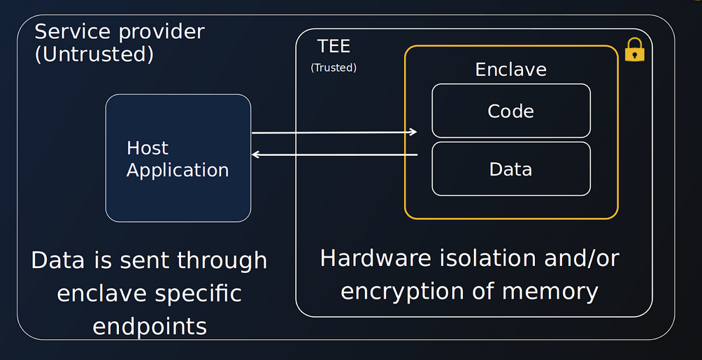

# How we protect your data
_________________________________

BlindBox protects user data with two key elements: 

+ By leveraging **confidential computing** technologies to deploy applications within secure hardware-based highly-isolated environment called **secure enclaves** or **Trusted Execution Environments (TEEs)**.
+ By allowing data owners to set **custom security policies** to control what can happen inside of their BlindBox enclave.

Let's now take a look at the technologies behind our solution and how they protect user data!

## Confidential Computing
__________________________

In typical workflows, data may be encrypted in transit, but it is accessible in clear when being analyzed by software. [Confidential computing](https://en.wikipedia.org/wiki/Confidential_computing) is a fast-growing new technology which aims to tackle this problem and protects data during computation.

Solutions usually center around three key concepts.

+ **Isolation**: data is processed in highly-isolated Trusted Execution Environments.
+ **Attestation**: we verify the authenticity of the Trusted Execution Environments and its components. 
+ **Runtime encryption**: data is encrypted, even during analysis.

Let's dive into a bit more detail about these concepts.

## Isolation
____________________________________

In a confidential workflow, data is sent to and analyzed within a **Trusted Execution Environment (TEE)**, otherwise known as a secure enclave. Data sent to the enclave is only decrypted in isolated environments or when being processed. Even if hackers or malicious insiders gain access to the host machine an enclave is running on, they will not be able to access data inside the enclave.

We currently support the following TEEs: **AMD SEV-SNP confidential VM**.

> You can check our guide to learn more about [AMD SEV-SNP](../concepts/amd-sev.md).

> If you are very interested in learning more about secure enclaves in practice, we are working on a [hands-on series](https://confidential-computing-explained.mithrilsecurity.io/en/latest/) explaining how Confidential Computing works. Developers can play with our tutorials and code their own simplified KMS with secure enclaves!

## Attestation
___________________

When a user wants to establish communication with an enclave, checks will first be performed to **verify the authenticity** of **the enclave identity and anything running inside the enclave** such as the **application** and **the trusted OS (where relevant)**. This process is called attestation.

!!! warning "Important"
    
    The goal of this process is to check that the code running is indeed the code of the application we are expecting and that it has not been tampered with. The attestation doesn't **audit the application code itself**. You could compare it to using a checksum utility when you download a software.
    

❌ If any of these **checks fail**, an error is produced and the **user will not be able to communicate with the enclave**. For BlindBox, this means that a user will only be able to connect to a genuine, verified TEE.

✔️ If these checks are **successful**, the user is able to **communicate** with the enclave **securely using TLS**. The enclave's private key never leaves the enclave, so it is never accessible to anyone, including the cloud or service provider!

Let's take a look at the basic attestation workflow for BlindBox:

 

1. When a user queries a BlindBox application, under-the-hood our client will attempt to create a connection between the user and the application running in the BlindBox. This will trigger the attestation process.

2. The TEE will be asked to generate a report to prove its identity. This report is signed by keys derived from hardware.

3. This report and a TLS certificate, which will be used for communications if attestation is successful, are sent back to the client.

4. A verification process is then triggered, where the client will check the TEE is authentic and has the expected identity and settings.

5. If the verification process is successful, communication via TLS is established and the query will be performed. If the verification process fails, an attestation error will be returned.

## Limitations
__________________________

With great security features comes great responsibilities! 

TEEs also have a general limitation which is very important to know : the **application code running in the TEE *must* be trusted**! While the attestation process verifies the authenticity of the enclave, it does not run any checks on what the verified application code does. An enclave protects what's inside it from the outside, but not what's inside from what is inside.

This is actually why we wrap application images in an  an **additional security layer** to BlindBox, so developers can define **custom security policies** for additional protection. For example, they could decide who can query the service in their BlindBox or restrict networking access to the application running within the enclave.
