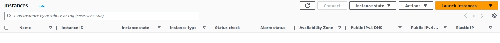
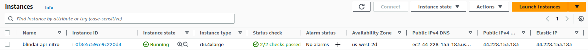

# Deploying your own BlindAI API Nitro server

In this guide, we'll show you how you can deploy your own instance of the BlindBox Nitro demo server featured in the Quick Tour and query the Whisper and OpenChatKit models you are serving.

## Pre-requisites
________________________

### AWS account and credits

To deploy your own BlindBox Nitro server instance, you will need an **AWS account** and **credits**.

!!! important

    When deploying your own Amazon EC2 R6i instance, you will be charged according to your usage as detailed by AWS. You can get a detailed pricing quote [here](https://aws.amazon.com/ec2/pricing/).

### Dependencies

Then you'll need to install:

- [AWS CLI](https://docs.aws.amazon.com/cli/latest/userguide/cli-chap-welcome.html), which allows us to interact with AWS cloud services via the command line.
- [Terraform](https://www.terraform.io/), which is a tool to automate a workflow where we provision the necessary Azure resources, configure our instance and deploy our enclave application.

> For alternative installation methods click [here](https://docs.aws.amazon.com/cli/latest/userguide/getting-started-install.html) for AWS CLI or [here](https://developer.hashicorp.com/terraform/downloads) for Terraform.

```bash
# install AWS CLI
curl "https://awscli.amazonaws.com/awscli-exe-linux-x86_64.zip" -o "awscliv2.zip"
unzip awscliv2.zip
sudo ./aws/install

# check it is now installed
aws --version

# install terraform
wget -O- https://apt.releases.hashicorp.com/gpg | sudo gpg --dearmor -o /usr/share/keyrings/hashicorp-archive-keyring.gpg
echo "deb [signed-by=/usr/share/keyrings/hashicorp-archive-keyring.gpg] https://apt.releases.hashicorp.com $(lsb_release -cs) main" | sudo tee /etc/apt/sources.list.d/hashicorp.list
sudo apt update && sudo apt install terraform

# check it is now installed 
!terraform --version
```

Next, you will need to **export your AWS credentials in the environment** you are working with.

```bash
export AWS_SECRET_ACCESS_KEY= # YOUR_AWS_SECRET_ACCESS_KEY_HERE
export AWS_ACCESS_KEY= # YOUR_AWS_ACCESS_KEY_HERE
```

## Deployment
__________________________

Once everything is setup, we are ready to deploy our BlindBox server!

Before starting, we can check our AWS instance dashboard and see we have no instances currently running:



We then clone the Nitro enclave server repo and deploy the server using `terraform apply`.

```bash
git clone "https://github.com/mithril-security/blindbox"
cd blindbox/ai_server_example
terraform apply
```

Terraform will produce some output in the terminal confirming the resources that will be allocated to us. You will notice in the details of these resources that `enclave_options`: `enabled` is set to `true`. You must select `yes` to confirm the allocation of these resources.

Terraform then runs our start script to deploy our BlindBox API application on the server instance.Now when we check out our instance dashboard on our AWS account, we can see our BlindBox Nitro server instance is now running:



> You can now get shell access to the application's host machine on port 22. You CANNOT get shell access to the enclave for security reasons.

You can send requests directly to the enclave on port 443.

```python
import requests

YOUR_INSTANCE_IP = # YOUR_INSTANCE_IP_ADDRESS_HERE
res = requests.post(
    "https://$YOUR_INSTANCE_IP/whisper/predict",
    files={
        "audio": open("test2.wav", "rb"),
    },
).text
```

### Using the BlindBox demo API with your own server instance

Let's take a look at how you can query models using your own BlindBox API server instance, rather than using the default one deployed by Mithril Security.

Firstly, you will need to connect to your server instance using the `blindbox.ai.connection` connect() method and providing it with your AWS instance's IP address.

This returns to us a `BlindBoxConnection` object which we will need when querying our models!

```python
#  connect to your server instance
YOUR_INSTANCE_IP = # YOUR_INSTANCE_IP_ADDRESS_HERE

client = blindbox.ai.connection.connect(
    addr=YOUR_INSTANCE_IP
)
```

We can now instruct the API to connect with our server instance, ratjer than creating a connection with Mithril Security's API Server, by providing our `BlindBoxConnection` object to the `connection` option when using our querying method.

```python
# Whisper query with connection to our server instance
transcript = blindbox.ai.Audio.transcribe("taunt.wav", connection=client)
```

```python
# OpenChatKit query with connection to our server instance
code = blindbox.ai.Audio.transcribe("Provide me with a Python function that prints out 1-10", connection=client)
```

## Conclusions
_________________

In this how-to guide, we have seen:
- How to deploy your own BlindBox server instance for querying models within nitro enclaves.
- Discovered how to use the BlindBox API library with your own server instance.