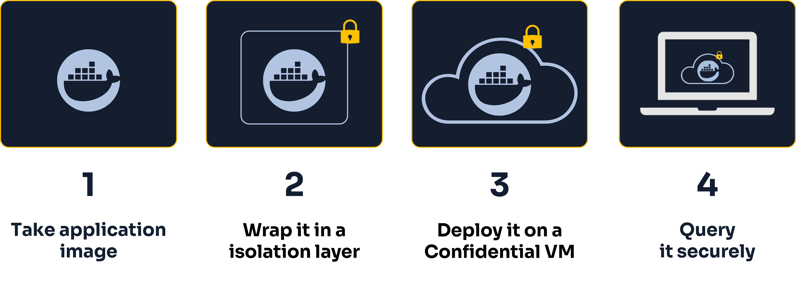
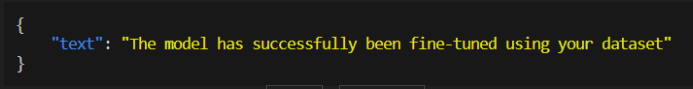

# Falcon-7B: How we created an API for fine-tuning and querying Falcon
______________________________
## Introduction
In this guide, we're going to cover how we created a **privacy-friendly API** for the [**Falcon-7B**](https://huggingface.co/tiiuae/falcon-7b) and [**Falcon-7B-instruct**](https://huggingface.co/tiiuae/falcon-7b-instruct) **LLM models** with **BlindBox**. We created both **finetuning** and **querying** endpoints for our API.

The Falcon-7b model is a lightweight version of the Falcon-40B model, the **best open-source LLM model currently available** which rivals closed-source models such as GPT4.

??? abstract "Learn more about the different Falcon model versions 🦅" 
    
    The Falcon model comes in a few different flavours. Let's take a quick look at the differences between a couple of key variants!

    #### Falcon-7B vs Falcon-40B

    As their names suggest, the [Falcon-7B](https://huggingface.co/tiiuae/falcon-7b) is a 7B parameter model, while the Falcon-40B is a 40B parameter model. The 7B is a lightweight version and requires up to 15GB of memory, whereas the 40B requires up to 90GB of memory.

    We use the Falcon-7B model for this demo.

    > If you wish to test out deploying the `falcon-40b` model using our open-source example code, just switch out the `falcon-7b` model name for `falcon-40b`.

    #### Falcon-7B vs Falcon-7B-instruct

    The Falcon-7B and Falcon-40B models are raw, pre-trained model, which need to be further finetuned for most use cases. It is best to use the `instruct` variants of these models if you just want to test the models quickly, without fine-tuning them.

    For our demo API we created `/finetune` and `/inference` endpoints for the `Falcon-7B` model. We also created a `/test` endpoint using the `Falcon-7b-instruct` model which doesn't require any fine-tuning and is ready to be queried straight out-the-box.

Use cases for the model include:

- Text generation
- Chatbots
- Natural language processing (NLP).

By using BlindBox to deploy the model, all interactions are kept **confidential at all times** and are **not exposed to the model provider**.

Preparing and deploying an application with BlindBox can be broken down into four stages:



In this tutorial, we are going to focus on the first step: **preparing the application image**.

We will split this step into two sub-steps:

1. How we **created a BlindBox-compatible API** for the models.
2. How we **created the Docker image** for our API.

> You can learn about how we deploy images with BlindBox in more detail in the [Quick tour](https://blindbox.mithrilsecurity.io/en/latest/docs/getting-started/quick-tour/).

Let's dive in!
## Packaging Falcon-7B with FastAPI
Our first task in deploying the **Falcon-7B** and **Falcon-7B-instruct** models inside of a secure **BlindBox** was to create an API so that our end users would be able to query the model. We did this using the **FastAPI library** which allows us to quickly assign functions to API endpoints.

We created the following three endpoints:

- **test**: Query the `falcon-7b-instruct` model. This option does not require fine-tuning and is best suited endpoint for taking generic instructions in a chat format.
- **finetune**: Finetune the `falcon-7b` model with your own datasets.
- **inference**: Query your finetuned `falcon-7b` model.

The full code we use to do this is available in the `server.py` file in the `examples/falcon` folder in BlindBox's official GitHub repository.

```python
!git clone https://github.com/mithril-security/blindbox
!cd examples/falcon
```

There are three key sections in our `server.py` code:

- The inital set-up of the models
- The definition of our API endpoints
- Serving our application

Let's take a closer look at these three sections.

### Initial set-up

Firstly, we download and configure our models and tokenizers. We also initalize our API object.

```python

# import necessary packages
from transformers import AutoModelForCausalLM, AutoTokenizer
from fastapi import FastAPI
from pydantic import BaseModel
import uvicorn
from datasets import load_dataset
from trl import SFTTrainer
from transformers import AutoTokenizer, AutoModelForCausalLM
from fastapi.responses import JSONResponse

# get 7b model and tokenizer
model_id = "tiiuae/falcon-7b"
model = AutoModelForCausalLM.from_pretrained(model_id, trust_remote_code=True)
model.config.use_cache = False
tokenizer = AutoTokenizer.from_pretrained(model_id, trust_remote_code=True)
tokenizer.pad_token = tokenizer.eos_token

#falcon-7b-instruct model and tokenizer
model_id = "tiiuae/falcon-7b-instruct"
instruct_model = AutoModelForCausalLM.from_pretrained(model_id, trust_remote_code=True)
instruct_tokenizer = AutoTokenizer.from_pretrained(model_id)
instruct_tokenizer.pad_token = instruct_tokenizer.eos_token

# Select cpu for CPU device or cuda for GPU device
device = "cpu"

# instantiate API object
app = FastAPI()
```

### Creating our endpoints

As we mentioned previously, there are three endpoints we needed to create: the `test` endpoint, the `fine-tuning` endpoint and the `inference` endpoint.

#### The test endpoint

We created our `test` POST endpoint on our FastAPI application object. This allows the user to send their prompt to the `Falcon-7B-instruct` model as a `POST request` using the `blindbox.requests` library.

```python
# Define request input object
class GenerateRequest(BaseModel):
    input_text: str
    max_new_tokens: int = 128

# Initialization of the test endpoint
@app.post("/test")
def test(req: GenerateRequest):

    # we go from string to token lists
    inputs = instruct_tokenizer.encode(req.input_text, return_tensors="pt").to(device)

    # query model with inputs
    outputs = instruct_model.generate(
        inputs,
        max_new_tokens=req.max_new_tokens,
        do_sample=True,
        top_k=10,
        num_return_sequences=1,
        eos_token_id=tokenizer.eos_token_id
    )

    # convert tokens back to a string
    text = tokenizer.decode(outputs[0])

    return {"text": text}
```

#### The fine-tuning endpoint
The next endpoint we created was the `/finetune` POST endpoint. This lets the user send a dataset as a request by sending the elements defined in the `FinetuneRequest` class below. The user's instance of the Falcon-7B model is then trained on their dataset.

> Note that large datasets are required to get the best results!

```python

# Define finetune request input object with necessary dataset fields
class FinetuneRequest(BaseModel):
    dataset_name: str
    question_column: str
    answer_column: str
    number_elements_for_training: int

# Initialization of the fine-tuning endpoint
@app.post("/finetune")
def finetune(req: FinetuneRequest):

    # load and trim the dataset
    if req.config_name == "":
        dataset = load_dataset(req.dataset_name)
    else:
        dataset = load_dataset(req.dataset_name, req.config_name)
    dataset= dataset['train'].select(range(req.number_elements_for_training))

    num_columns = dataset.num_columns
    column_names = dataset.column_names
    for i in range(num_columns):
        if column_names[i]!=req.question_column and column_names[i]!=req.answer_column:
          dataset = dataset.remove_columns(column_names[i])

    # format the data
    def formatting_prompts_func(example):
        text = f"### Question: {example['question']}\n ### Answer: {example['answer']}"
        return text

    # instantiate the trainer
    if req.question_column!=req.answer_column:
        trainer = SFTTrainer(
            model=model,
            tokenizer=tokenizer,
            train_dataset=dataset,
            dataset_text_field=req.question_column,
            max_seq_length=512,
            formatting_func=formatting_prompts_func,
            packing=True,
        )
    else:
        trainer = SFTTrainer(
            model=model,
            tokenizer=tokenizer,
            train_dataset=dataset,
            dataset_text_field=req.question_column,
            max_seq_length=512,
            packing=True,
        )

    # launch the training
    trainer.train()

    return JSONResponse(content={"text": "The model has successfully been finetuned using your dataset"})
```

#### The inference endpoint
Finally, we created an `/inference` POST endpoint on our FastAPI application object. This is identical to our `test` endpoint - except that we query the model the user previously finetuned based on the `falcon-7b` model, instead of the `falcon-7b-instruct` model.

```python

# Initialization of the inference endpoint
@app.post("/inference")
def inference(req: GenerateRequest):

    # we go from string to token lists
    inputs = instruct_tokenizer.encode(req.input_text, return_tensors="pt").to(device)

    # query model with inputs
    outputs = model.generate(
        inputs,
        max_new_tokens=req.max_new_tokens,
        do_sample=True,
        top_k=10,
        num_return_sequences=1,
        eos_token_id=tokenizer.eos_token_id
    )

    # convert tokens back to a string
    text = tokenizer.decode(outputs[0])

    return {"text": text}
```
### Launching our server

We deployed our API on a python ASGI `uvicorn` server (an asynchronous web server) on `port 80`. It is essential to use **port 80** as BlindBox will need to be able to communicate with our application on this port!

```python
if __name__ == "__main__":
    uvicorn.run(app, host="0.0.0.0", port=80)
```

### Wrapping our API into a Docker image

In order to deploy our application on BlindBox, we need to wrap our application within a Docker image.

To do this we created a Dockerfile where we download any necessary dependencies and copy and launch our `sever.py` file within the Docker container.

```bash
FROM python:3.10.10-bullseye as base

RUN pip install \
    datasets \
    trl \
    einops \
    torch==2.0.1  \
    transformers==4.26.1 \
    fastapi==0.95.0 \
    python-multipart==0.0.6 \
    uvicorn==0.21.1 \
    pydantic==1.10.7 \
    intel_extension_for_pytorch==1.13.100 \
    --extra-index-url https://download.pytorch.org/whl/cpu

COPY ./server.py ./

CMD python ./server.py
```

For more details on how to deploy application images on BlindBox, see our [Quick Tour](../getting-started/quick-tour.ipynb).

### Example queries

Let's now take a look at a few example queries we could send to our Falcon application once deployed with BlindBox.

In order to query applications deployed with BlindBox, we will need to download the `BlindBox.requests` package module.

```python
!pip install blindbox

import blindbox.requests
```

#### Querying the `/test` endpoint

```python
USER_PROMPT = "Write a poem about cyber security"

# set your confidential VM IP address and port (this should always be port 80)
CONFIDENTIAL_VM_IP_ADDRESS = "127.0.0.1:80"

# we query our application with out user prompt
res = requests.post(url=f"http://{CONFIDENTIAL_VM_IP_ADDRESS}/test", json={"input_text": USER_PROMPT})
```

```bash
# Output

$ python3.10 test-query.py
{"text":"Write a poem about cyber security
Cyber-attacks are on the rise,
And they can strike at any time,
The threat is real, the damage is severe,
So be aware and protect your data with care.
It's vital that you stay alert,
And not let your guard down,
Hackers can steal your personal details,
With malicious code that's designed to track you down.
Use two-factor authentication,
And keep your devices up to date,
Install antivirus software,
And ensure that your passwords are strong and long.
Always think before you click,
And never give away too much,
"}
```

#### Querying the `/finetuning` endpoint

??? abstract "Find out more about the required dataset and request formatting" 

    Before we can query our `finetune` endpoint with BlindBox, there are a few formatting requirements that we need to understand so that our fine-tuning script can run properly. 

    Firstly, a dataset must contain:

    - a **train** split
    - an **input column of type "String"**
    - an **output column**

    Secondly, when querying the endpoint, we need to provide the following information about our dataset:
    - `dataset_name`: The name of the dataset.
    - `config_name`: The name of the subset if there is one. Put `" "` if there is none.
    - `question_column`: The name of the column that contains your question/input data.
    - `answer_column`: The name of the column that contains your answer/output data.
    - `number_elements_for_training`: The number of data entries from your dataset that you wish to use for fine-tuning.

```python
# example of finetuning request
res = requests.post(url=f"http://{CONFIDENTIAL_VM_IP_ADDRESS}/fine_tune", json={"dataset_name" : "innermost47/alpaca-fr", "config_name" : "", "question_column" : "instruction", "answer_column" : "output", "number_elements_for_training" : 20})
```
If your request is succesful, you'll see the following output.



> Note that if you do not have a sufficient number of elements set for the `number_of_for_training` argument in your request, you may receive an `Internal Server Error`. You can resolve this issue by increasing the number of elements.

#### Querying the `/inference` endpoint

```python
USER_PROMPT = "How do I make pasta?"

# query our inference endpoint with user prompt
res = requests.post(url=f"http://{CONFIDENTIAL_VM_IP_ADDRESS}/inference", json={"input_text": USER_PROMPT})
```

```bash
# Output

$ python3.10 inference-query.py
{"text":"How do I make pasta?
1. Gather all the ingredients you need: flour, salt, water, and a pasta machine.
2. Measure the ingredients and add them to a bowl.
3. Mix the ingredients together with a spoon.
4. Add water to the mixture and mix until it forms a dough.
5. Let the dough rest for 30 minutes.
6. Roll the dough into a long, thin tube.
7. Cut the tube into 1-inch pieces.
8. Boil the pasta in salted water for 3 to 5 minutes.
"}
```

> Note that if you do not have a sufficient number of elements set for the `number_of_for_training` argument in your request, you may receive an `Internal Server Error`. You can resolve this issue by increasing the number of elements.

## Conclusions
In this tutorial, we've seen how we can:

- Create a **BlindBox-compatible** API serving Falcon models.
- Create an **application image**, ready to be built and deployed on BlindBox!
- **Finetune** and **query** our Falcon API.


